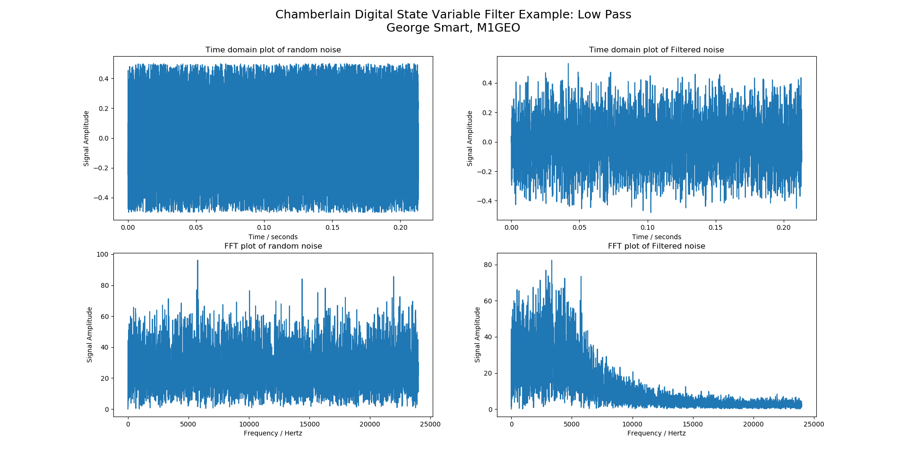
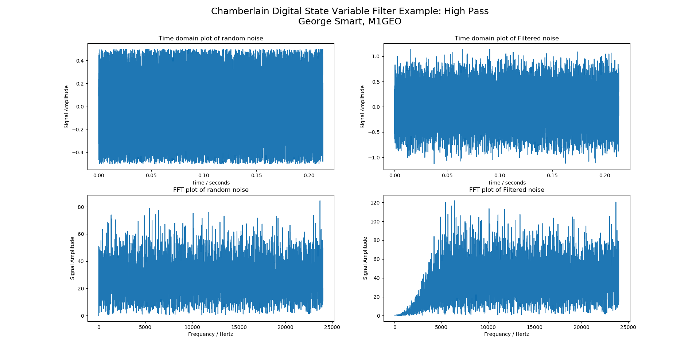
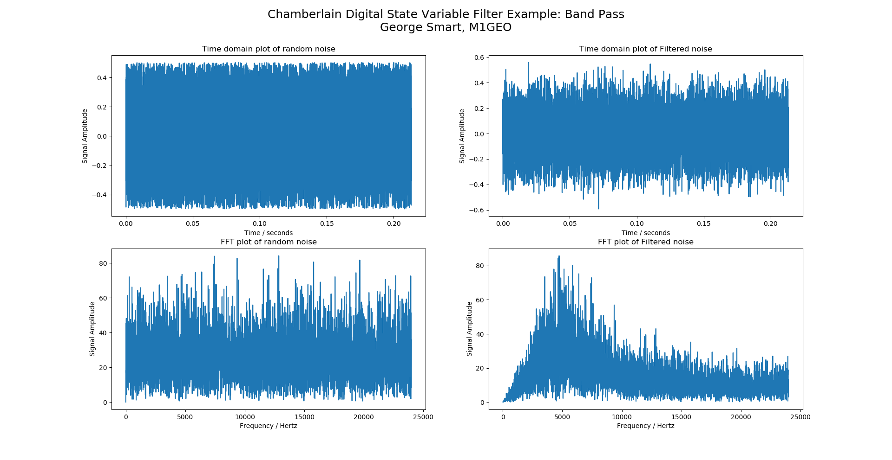
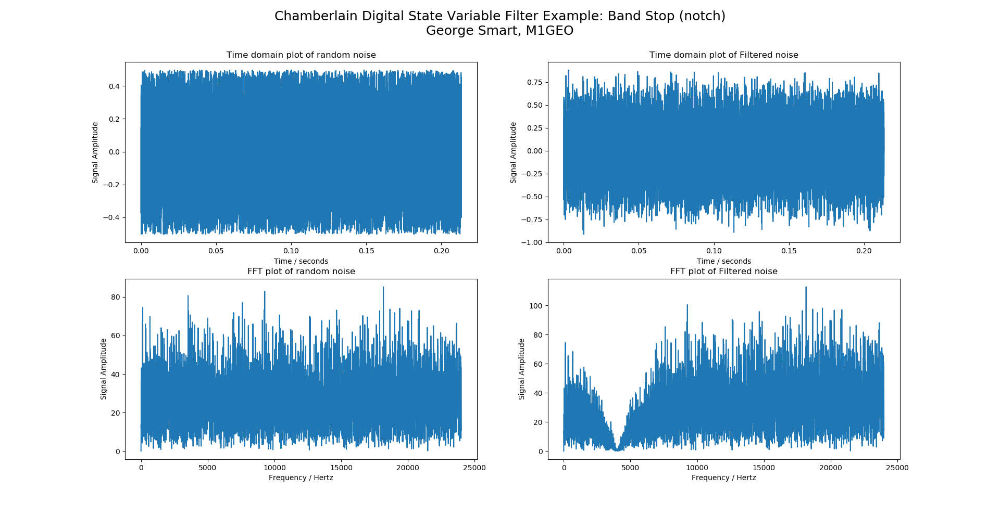

# chamberlain-state-variable-filter
Python3 Class example of a Chamberlain Digital State Variable Filter

This code can either be imported in as a module, or hacked about as is.

The code, if executed in Python3 will generate some random noise, 
perform an FFT of it to show the noise in the frequency domain, as 
well as filter the noise and display the post filtering time and 
frequency domain result. The FFTs have a linear amplitude scale.

All Corner Frequencies in the figures are 4 kHz.

Feel free to use this code for what you like. Attribution is nice!

# Low Pass

# High Pass

# Band Pass

# Band Stop (Notch)

